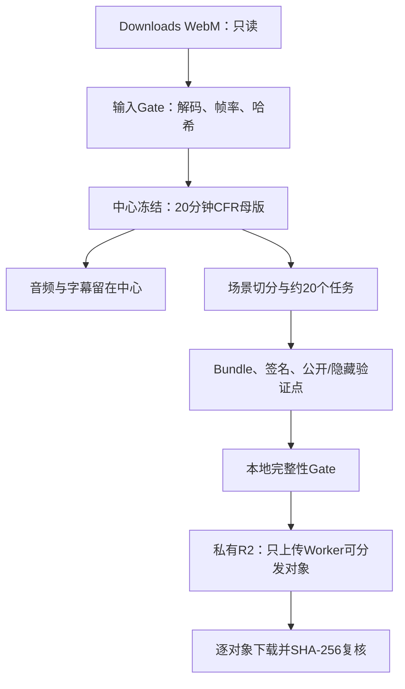

# DTVS Phase 6A→6B：本地WebM片源到R2任务仓库执行工作流

- **状态**：READY_FOR_LOCAL_CODEX_EXECUTION
- **输入**：本机 `Downloads` 中的一个 `.webm` 片源
- **输出**：冻结20分钟母版、约20个签名任务、R2上传Manifest与Verified Receipt
- **目标终端**：单台RTX 4060 Worker Pack v0.1
- **标准**：DTVS Spec v0.2.2
- **前提**：Phase 0–5实现已完成；R2工作流已进入仓库

## 0. 直接交给Codex的执行指令

你现在负责在运行DTVS仓库的**本机Codex环境**中，将用户Downloads目录内的WebM片源转换为DTVS 20分钟单机Pilot任务，并上传允许分发的任务对象到私有Cloudflare R2。

必须完整读取：

```text
spec/DTVS_SPEC_v0.2.2_ASYMMETRIC_VERIFIED_PIPELINE.md
docs/CODEX_WORKER_PACK_V0.1_IMPLEMENTATION_WORKFLOW_CN.md
docs/CODEX_R2_TASK_UPLOAD_WORKFLOW_CN.md
docs/CODEX_PHASE6A_WEBM_TO_R2_EXECUTION_CN.md
```

严格执行本文的 `WEBM-0` 至 `WEBM-8`。不得删除、移动或修改Downloads中的原始WebM。不得上传完整原片、20分钟中心母版、音频、字幕、中心私钥或隐藏验证点。不得把任何媒体提交GitHub。

如果当前Codex运行在云端或容器中，无法读取用户本机Downloads目录，立即停止并报告：

```text
BLOCKED_LOCAL_SOURCE_NOT_ACCESSIBLE
```

不得假装已读取本地文件，也不得从互联网重新下载一个不同版本代替。

## 1. 本轮责任链



## 2. 运行入口

最终应实现并运行：

```powershell
./scripts/prepare_webm_pilot.ps1 `
  -SourcePath "$env:USERPROFILE\Downloads\<actual-file>.webm" `
  -SegmentStart "00:10:00.000" `
  -DurationSeconds 1200 `
  -Config "configs/metropolis_20m_v022.json"
```

然后：

```powershell
./scripts/prepare_and_upload_r2_tasks.ps1 `
  -RunId "<generated_run_id>" `
  -Bucket "dtvs-pilot-assets"
```

在macOS本机Codex环境中，源文件通常位于：

```text
/Users/<username>/Downloads/<actual-file>.webm
```

不得在脚本或Git配置中冻结具体用户名。必须由参数传入或从系统标准Downloads位置发现。

## 3. 目标本地目录

```text
dtvs/
├── inputs/
│   ├── source_master.webm
│   ├── source_master.webm.sha256
│   ├── source_origin.json
│   └── subtitles_zh.srt                 # 仅在真实存在时
├── runs/<run_id>/
│   ├── center/
│   │   ├── master/
│   │   │   ├── source_20m_video_cfr.mkv
│   │   │   ├── source_20m_audio.flac    # 如果存在音频
│   │   │   ├── subtitles_20m_zh.srt     # 如果存在合格字幕
│   │   │   ├── asset_manifest.json
│   │   │   ├── source_probe.json
│   │   │   └── decode_check.json
│   │   ├── private/
│   │   │   ├── hidden_checks.json
│   │   │   └── signing_keys/
│   │   └── task_index.json
│   ├── task-inputs/
│   │   ├── T0001/
│   │   │   ├── input_with_context.mkv
│   │   │   ├── task_bundle.json
│   │   │   ├── task_bundle.sig
│   │   │   └── public_anchors.json
│   │   └── ...
│   ├── upload-control/
│   │   ├── upload_manifest.json
│   │   ├── upload_receipt.json
│   │   └── r2_upload_events.jsonl
│   └── run_manifest.json
└── reports/<run_id>/
    ├── source_gate_report.json
    ├── task_compilation_report.json
    └── phase6ab_summary.md
```

整个 `inputs/**`、`runs/**` 和私钥目录必须保持Git忽略。

## 4. WEBM-0：环境与仓库基线

### 操作

1. 定位DTVS仓库并读取 `AGENTS.md`（如存在）；
2. 检查 `git status --short`，保护用户已有修改；
3. 运行当前全部测试；
4. 检查Python、FFmpeg、ffprobe、Node和Wrangler；
5. 确认Phase 0–5的CLI和模块真实存在；
6. 检查可用磁盘空间；
7. 只报告Cloudflare环境变量为 `present/missing`，不显示值。

### 命令

```powershell
python --version
ffmpeg -version
ffprobe -version
node --version
npx wrangler --version
python -m pytest -q
```

如项目当前测试入口不是pytest，使用仓库已有入口并记录实际命令。

### Gate

- 现有测试通过；
- FFmpeg/ffprobe可用；
- 至少有完成中心母版和任务生成所需的可用空间；
- 没有无法安全绕开的用户修改冲突。

失败时不得触碰源文件。

## 5. WEBM-1：发现并锁定本地片源

### 5.1 文件发现

Windows只读列出：

```powershell
Get-ChildItem "$env:USERPROFILE\Downloads" -File -Filter "*.webm" |
  Select-Object FullName, Length, LastWriteTime
```

macOS/Linux只读列出：

```bash
find "$HOME/Downloads" -maxdepth 1 -type f -iname '*.webm' -print
```

规则：

- 如果明确传入 `-SourcePath`，只使用该文件；
- 如果Downloads只有一个WebM，可以选用该文件；
- 如果存在多个WebM且未传入路径，停止并列出文件名、大小和修改时间；
- 不得按“最大文件”或“最新文件”擅自选择；
- 不得读取Downloads之外的其他个人目录；
- 不得删除、移动、重命名或覆盖原始文件。

### 5.2 固定输入副本

将源文件复制到：

```text
inputs/source_master.webm
```

复制前后分别计算SHA-256，必须一致。已存在目标文件时：

- 哈希相同：复用；
- 哈希不同：停止，禁止覆盖；
- 新版本使用新文件名或新的asset/run，不破坏旧证据。

生成 `source_origin.json`：

```json
{
  "schema_version": "0.2.2",
  "original_filename": "...webm",
  "original_bytes": 0,
  "source_sha256": "...",
  "copied_at": "...Z",
  "rights_status": "OPERATOR_CONFIRMED",
  "rights_note": "Software does not determine copyright status",
  "internet_source_url": null
}
```

不得把本机绝对用户名路径写入公开Manifest；原始绝对路径只允许出现在本地私有操作日志中。

## 6. WEBM-2：源文件事实Gate

### 6.1 ffprobe

执行：

```powershell
ffprobe -v error `
  -show_format `
  -show_streams `
  -count_frames `
  -of json `
  "inputs/source_master.webm" `
  > "runs/<run_id>/center/master/source_probe.json"
```

解析并冻结：

- 容器；
- 视频codec；
- width/height；
- `r_frame_rate`；
- `avg_frame_rate`；
- time base；
- duration；
-可用时的帧数；
- 像素格式与色彩字段；
- 音频流；
- 字幕流；
- 文件字节数与SHA-256。

### 6.2 完整视频解码

Windows：

```powershell
ffmpeg -v error -i "inputs/source_master.webm" -map 0:v:0 -f null NUL
```

macOS/Linux：

```bash
ffmpeg -v error -i inputs/source_master.webm -map 0:v:0 -f null -
```

把退出码、错误行数、首个错误和完成时间写入 `decode_check.json`。

### 6.3 Gate

必须满足：

- 存在一个可用视频流；
- 视频时长覆盖 `segment_start + 1200秒`；
- 能完整解码；
- width、height、fps和time base可解析；
- 无零帧或明显截断；
- 不是仍在下载的临时文件；
- 复制前后哈希一致。

以下情况停止：

```text
SOURCE_DECODE_FAILED
SOURCE_DURATION_INSUFFICIENT
SOURCE_VIDEO_STREAM_MISSING
SOURCE_HASH_MISMATCH
SOURCE_FRAME_RATE_UNRESOLVED
```

低分辨率本身不阻止流程Pilot，但必须在报告中标记：

```text
QUALITY_CLAIM_LIMITED_BY_SOURCE
```

## 7. WEBM-3：冻结20分钟区间

### 7.1 时间区间

默认沿用已冻结Pilot配置：

```text
segment_start = 00:10:00.000
duration = 1200 seconds
```

如果配置中已有不同的明确值，以配置为准。Codex不得基于观看偏好静默更换区间。

必须把时间范围换算为整数帧范围。项目内统一使用半开区间：

```text
[segment_start_frame, segment_end_frame_exclusive)
```

浮点秒不能作为后续任务的唯一定位依据。

### 7.2 CFR判断

如果源片已被证明是稳定CFR：

- 保留其精确有理数帧率；
- 不强制改成25fps或30fps。

如果源片是VFR或时间戳不稳定：

- 生成明确的CFR母版；
- 选择最接近源片主帧率的精确有理数；
- 记录转换前后帧数、时间戳策略和FFmpeg命令；
- 不得只用字符串近似帧率。

### 7.3 中心视频母版

生成视频独立母版：

```text
runs/<run_id>/center/master/source_20m_video_cfr.mkv
```

推荐使用FFV1作为中心无损/可验证母版，但必须先估算磁盘；如果空间不足，停止请求用户选择，不得静默改成高损有损编码。

示例结构，实际fps必须从probe取得：

```powershell
ffmpeg -ss "<segment_start>" `
  -i "inputs/source_master.webm" `
  -t 1200 `
  -map 0:v:0 -an `
  -vf "fps=<exact_rational>,format=yuv420p" `
  -c:v ffv1 -level 3 -coder 1 -context 1 -g 1 `
  "runs/<run_id>/center/master/source_20m_video_cfr.mkv"
```

如果源片为CFR，且不需要fps滤镜，禁止无意义重采样。

### 7.4 母版验收

- 完整解码；
- 精确目标帧数；
- 无音频、无字幕；
- 帧率和time base冻结；
- SHA-256已生成；
- 首尾帧指纹已生成；
- `asset_manifest.json`已通过Schema。

## 8. WEBM-4：音频与中文字幕

### 8.1 音频

如果存在音频流，中心提取20分钟音频：

```text
runs/<run_id>/center/master/source_20m_audio.flac
```

如果没有音频，记录 `AUDIO_ABSENT`，不阻止视频任务编译。

音频不进入Worker任务，不上传R2 task-inputs。

### 8.2 字幕优先级

只允许以下来源：

1. 用户提供并确认的本地 `inputs/subtitles_zh.srt`；
2. WebM中真实存在、语言和编码确认的中文字幕流；
3. 后续单独人工/模型生成并经过人工复核的字幕版本。

如果WebM含合格中文字幕流，可提取并重定时到20分钟区间。

如果没有中文字幕：

```text
subtitle_state = SUBTITLE_PENDING
```

允许继续完成视频任务分割与R2上传，但完整Pilot最终状态不得为 `VERIFIED`，也不得生成虚构字幕。不得自动把英文字幕宣称为中文。

字幕只保存在中心目录，不上传给Worker。

### 8.3 字幕检查

- UTF-8；
- 时间戳单调；
- 无负时间；
- 全部cue位于0–1200秒；
- 不重复；
- 不包含明显模板占位符；
- 保存来源、版本、SHA-256和人工复核状态。

## 9. WEBM-5：场景切分与任务输入

### 9.1 任务规则

- 目标核心长度约60秒；
- 允许30–120秒；
- 优先靠近场景边界；
- 左右各16帧上下文；
- 第一和最后任务按母版边界截断上下文；
- Worker接收上下文，但只返回核心帧；
- 核心区间连续、零重叠、零缺口。

预期约20个任务；场景切分导致数量略有变化时，必须说明。为了当前Pilot统计一致性，优先编译为20个任务；不能为了强行20个而破坏30–120秒Gate。

### 9.2 任务MKV编码

每个 `input_with_context.mkv` 必须：

- 从中心CFR母版按整数帧提取；
- 不含音频和字幕；
- 保留可逆的全局帧映射；
- 采用冻结的中间编码；
- 可完整解码；
- 不超过Wrangler 315 MiB Gate；
- SHA-256写入Task Bundle。

如果无损任务超过315 MiB，不得静默降质。必须在签名前决定并冻结一个质量足够、体积受控的中间编码；所有任务使用同一策略。已经签名后不得重新编码原Key。

### 9.3 覆盖证明

生成 `task_compilation_report.json`，至少证明：

```text
first_core_start == segment_start_frame
last_core_end_exclusive == segment_end_frame_exclusive
task[i].core_end_exclusive == task[i+1].core_start
sum(core_frame_count) == segment_total_frames
duplicate_core_frames == 0
missing_core_frames == 0
```

## 10. WEBM-6：Bundle、签名与验证点

对每个任务生成：

```text
input_with_context.mkv
task_bundle.json
task_bundle.sig
public_anchors.json
```

中心私有目录生成：

```text
hidden_checks.json
signing_keys/private_key
```

要求：

- Task Bundle符合v0.2.2 Schema；
- Ed25519签名可验证；
- 任一签名字段修改后验签失败；
- Bundle记录核心、上下文、全局帧率、预期核心帧数；
- 输入、模型、参数和Worker Pack版本哈希完整；
- `upload_threshold=90`；
- `minimum_component_score=70`；
- 隐藏验证点不进入Bundle、公开锚点或上传清单；
- 私钥不进入Run公开目录。

## 11. WEBM-7：R2上传前本地Gate

调用：

```powershell
python scripts/prepare_r2_upload.py --run-id "<run_id>"
```

必须确认：

- 所有Task Index登记任务存在；
- 每个任务四个文件齐全；
- 所有MKV完整解码；
- 所有哈希一致；
- 所有签名通过；
- 核心覆盖零缝隙、零重叠；
- 每个对象不超过315 MiB；
- 上传清单不含完整源片、20分钟母版、音频、字幕、隐藏检查和密钥；
- Git状态未出现媒体、密钥或Secret待提交。

生成清单摘要后再进入R2写入。若实现环境允许非阻塞输出，可继续；若Codex发现任何范围不确定，停止要求人工检查。

## 12. WEBM-8：私有R2上传与验证

严格调用：

```text
docs/CODEX_R2_TASK_UPLOAD_WORKFLOW_CN.md
```

顺序：

1. 只读检查Cloudflare身份与Bucket；
2. 创建或复用唯一私有Bucket `dtvs-pilot-assets`；
3. 运行smoke object上传/下载检查；
4. 上传任务MKV；
5. 上传公开锚点、Bundle和签名；
6. 最后上传Task Index、Run Manifest、Upload Manifest和Receipt；
7. 每个远端对象重新下载并计算SHA-256；
8. 所有对象一致后Receipt才允许 `VERIFIED`。

本阶段不创建预签名URL，不连接Worker，不上传Worker结果。

## 13. 自动化脚本要求

Codex应新增或补齐：

```text
scripts/
├── discover_webm_source.py
├── inspect_webm_source.py
├── prepare_webm_pilot.py
├── prepare_webm_pilot.ps1
└── verify_phase6ab.py
```

核心逻辑放Python，PowerShell只包装参数和顺序。所有外部命令使用参数列表调用，不使用包含未经验证文件名的shell拼接。

最低CLI：

```text
dtvs source discover --downloads
dtvs source inspect --source <path>
dtvs coordinator prepare-webm --source <path> --segment-start <hms> --duration 1200
dtvs coordinator compile --run <run_id>
dtvs coordinator validate-upload --run <run_id>
dtvs coordinator upload-r2 --run <run_id> --resume
dtvs pilot phase6ab-status --run <run_id>
```

## 14. 测试矩阵

### 无真实电影fixture测试

- Downloads无WebM；
- Downloads一个WebM；
- Downloads多个WebM拒绝自动选择；
- 目标输入已存在且哈希不同；
- 截断WebM完整解码失败；
- 时长不足20分钟；
- CFR与VFR分支；
- 无音频；
- 无字幕时 `SUBTITLE_PENDING`；
- 核心帧零缝隙与人为缺帧；
- 任务对象超过315 MiB；
- 禁止文件不会进入上传清单；
- 私钥不会进入Git或R2清单。

### 真实WebM检查

- 源文件SHA-256；
- 完整解码；
- 20分钟母版完整解码；
- 精确帧数；
- 约20个任务全部可解码；
- Bundle全部验签；
- R2全部对象下载哈希一致。

测试不得将真实WebM加入fixture或Git。

## 15. 失败恢复

- 原始WebM永远只读；
- 母版生成使用 `.partial`，校验后原子改名；
- Task生成失败只重做失败Task，不覆盖已验证Task；
- 修改分割策略必须创建新的Task Index版本；
- R2上传从Receipt恢复；
- 已Verified的远端对象不重复上传；
- 远端同Key冲突时停止，不覆盖、不删除；
- 重新选择20分钟区间必须创建新 `asset_id/run_id`。

## 16. 成功状态定义

Phase 6A通过：

```text
PHASE_6A_SOURCE_AND_TASKS_VERIFIED
```

条件：

- WebM输入通过事实Gate；
- 20分钟母版冻结；
- 音频/字幕状态明确；
- 任务完整编译；
- 帧覆盖正确；
- Bundle签名有效；
- 上传清单不含禁止文件。

Phase 6B通过：

```text
PHASE_6B_R2_TASK_UPLOAD_VERIFIED
```

条件：

- Bucket私有；
- 所有允许对象已上传；
- 全部远端下载副本SHA-256一致；
- Receipt为VERIFIED；
- 无完整片源、母版、音频、字幕、隐藏验证点和密钥进入R2分发区。

如果字幕缺失，可以通过6A/6B的视频任务准备，但Run必须同时标记：

```text
SUBTITLE_PENDING
FINAL_PILOT_VERIFICATION_BLOCKED
```

## 17. Codex最终回报模板

```markdown
# DTVS Phase 6A/6B执行结果

- 总状态：PASS / PARTIAL / BLOCKED / FAIL
- 源文件：已读取 / 不可访问（只显示文件名）
- 源文件字节数：...
- 源SHA-256：...
- 源分辨率：...
- 源codec：...
- 源帧率：...
- CFR/VFR：...
- 完整解码：PASS / FAIL
- 20分钟区间：...
- 母版总帧数：...
- 音频：PRESENT / ABSENT
- 中文字幕：VERIFIED / PENDING / REJECTED
- Task数量：...
- 核心缺帧：...
- 核心重复帧：...
- 最大任务对象：... bytes
- Bundle验签：.../...通过
- Phase 6A：PASS / FAIL
- R2 Bucket：dtvs-pilot-assets
- Bucket状态：PRIVATE / UNKNOWN
- R2对象数：...
- R2总字节：...
- 下载SHA-256复核：.../...通过
- Phase 6B：PASS / FAIL
- Run ID：...
- Manifest SHA-256：...
- Receipt SHA-256：...
- 测试：通过X / 失败Y / 跳过Z
- Git Commit：...
- 下一步：生成短期Assignment并在RTX 4060终端运行
- 阻断项：...
```

不得在报告中输出本机用户名绝对路径、Cloudflare Secret、完整Account ID、私钥或授权URL。

## 18. 禁止事项

Codex不得：

- 修改或删除Downloads原始WebM；
- 多文件时擅自选择；
- 从互联网换片源；
- 未完整解码就继续；
- 把VFR近似当作CFR；
- 将低分辨率上采样描述为恢复真实4K细节；
- 编造或自动宣称中文字幕已经复核；
- 上传完整片源、20分钟母版、音频或字幕；
- 上传隐藏检查、中心私钥或Secret；
- 把媒体加入Git/Git LFS/GitHub Release；
- 为绕过315 MiB Gate静默降质；
- 覆盖R2同Key对象；
- 在Phase 6A/6B完成后声称完整Pilot已完成。

本工作流完成后的正确下一步是：生成短期Assignment和R2预签名GET/PUT地址，再由RTX 4060 Worker执行实际修复、LAS门控、结果上传、云端验证和最终中心合成。
