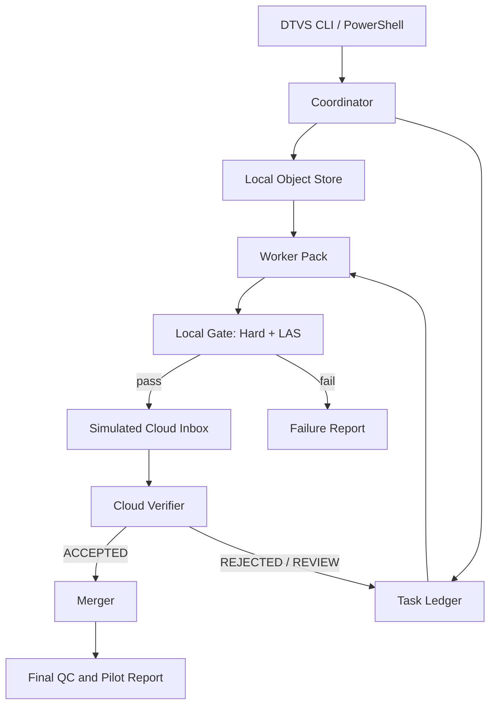

# DTVS Worker Pack v0.1 与 20 分钟单机 Pilot：Codex 实施工作流

- **文档状态**：READY_FOR_IMPLEMENTATION
- **依据标准**：DTVS Spec v0.2.2（冻结稿）
- **目标环境**：Windows 10/11、RTX 4060、Python 3.11+、FFmpeg 6+
- **开发方式**：在现有 `roalstoney-alt/dtvs` 仓库增量开发
- **明确边界**：本任务只实现单机角色模拟和证据链，不声称已完成真实分布式网络

## 0. 给 Codex 的总指令

你现在负责在现有 DTVS 仓库中开发：

1. `Worker Pack v0.1`；
2. 20 分钟旧电影 4K 修复的单机 Pilot 执行工具；
3. 单机内相互隔离的 Coordinator、Worker、Cloud Verifier 和 Merger；
4. 与 Spec v0.2.2 一致的任务、状态、证据、故障恢复和验收链路。

必须在现有代码上增量开发，不得删除 v0.2.1 Runner。不得为了让测试通过而降低冻结阈值、跳过失败或伪造媒体处理结果。没有真实片源、GPU、模型或 FFmpeg 时，必须使用明确标记的 fixture/mock 完成结构测试，并把真实 GPU 测试保留为 `SKIPPED_WITH_REASON`，不得报告为已通过。

每个阶段都执行：

```text
检查现状 → 写失败测试 → 最小实现 → 运行测试 → 检查证据 → 小提交
```

遇到 Spec 与实现冲突时，以 Spec v0.2.2 为准；如 Spec 无法确定，停止扩展语义，建立 GitHub Issue，不得自行改变标准。

## 1. 本轮可交付结果

完成后，仓库必须能用一条 Windows PowerShell 命令启动 Pilot：

```powershell
./scripts/run_v022_pilot.ps1 -Config configs/metropolis_20m_v022.json
```

该命令应完成或恢复以下过程：

```text
冻结输入
→ 编译约20个任务
→ 中心签名
→ Worker验签和执行
→ 本地硬门槛与LAS
→ 合格任务上传到模拟云端
→ 云端100%结构检查和隐藏抽检
→ 仅合并ACCEPTED任务
→ 中心统一加入音频与中文字幕
→ 生成完整Pilot报告
```

最终至少生成：

- 20 个签名 Task Bundle；
- 每次执行的 Attempt Manifest；
- checkpoints、事件日志、能耗采样；
- 每个任务的本地 QC、LAS 分项和上传判断；
- 每个上传任务的云端 Verdict；
- accepted index、边界检查和最终文件哈希；
- 自动化 Pilot 汇总报告和待人工抽检表；
- 故障注入及恢复记录。

## 2. 目标架构



四个角色必须使用不同目录和接口。即使都在一台电脑运行，也不得由 Worker 直接写入中心的 `ACCEPTED` 状态或最终合成目录。

## 3. 目标项目目录

```text
dtvs/
├── dtvs/
│   ├── __init__.py
│   ├── cli.py
│   ├── common/
│   │   ├── canonical_json.py
│   │   ├── hashing.py
│   │   ├── media_probe.py
│   │   ├── paths.py
│   │   ├── timebase.py
│   │   └── errors.py
│   ├── contracts/
│   │   ├── models.py
│   │   ├── validation.py
│   │   ├── signing.py
│   │   └── state_machine.py
│   ├── coordinator/
│   │   ├── asset_freezer.py
│   │   ├── scene_splitter.py
│   │   ├── verification_points.py
│   │   ├── task_compiler.py
│   │   └── ledger.py
│   ├── worker/
│   │   ├── preflight.py
│   │   ├── bundle_loader.py
│   │   ├── executor.py
│   │   ├── checkpoint.py
│   │   ├── energy.py
│   │   ├── local_qc.py
│   │   └── uploader.py
│   ├── verifier/
│   │   ├── intake.py
│   │   ├── structural_qc.py
│   │   ├── hidden_checks.py
│   │   ├── rerender.py
│   │   └── verdict.py
│   ├── merger/
│   │   ├── accepted_index.py
│   │   ├── boundary_qc.py
│   │   ├── video_merge.py
│   │   └── delivery.py
│   └── reporting/
│       ├── pilot_report.py
│       ├── economics.py
│       └── evidence_manifest.py
├── schemas/
│   ├── asset_manifest.schema.json
│   ├── task_bundle_v022.schema.json
│   ├── attempt_manifest.schema.json
│   ├── local_qc.schema.json
│   ├── cloud_verdict.schema.json
│   └── run_manifest_v022.schema.json
├── configs/
│   └── metropolis_20m_v022.json
├── scripts/
│   ├── run_v022_pilot.ps1
│   └── inject_fault.ps1
├── tests/
│   ├── unit/
│   ├── contract/
│   ├── integration/
│   ├── fixtures/
│   └── gpu/
├── docs/
│   ├── WORKER_PACK_V0.1_WINDOWS_INSTALL_CN.md
│   ├── PILOT_V022_OPERATOR_RUNBOOK_CN.md
│   └── FAILURE_CODES.md
└── scripts/dtvs_pilot.py  # v0.2.1基线，只修严重安全缺陷
```

## 4. 核心数据契约

所有 JSON 输出必须：

- UTF-8；
- 使用冻结的 canonical JSON 规则后再签名；
- 包含 `schema_version`；
- 通过对应 JSON Schema；
- 时间使用 UTC ISO-8601；
- 文件摘要使用 SHA-256；
- 帧范围使用闭区间或半开区间中的一种，并在全项目统一；建议半开区间 `[start, end)`；
- 禁止以浮点秒作为唯一帧定位依据。

### 4.1 Asset Manifest

至少包含：

```json
{
  "schema_version": "0.2.2",
  "asset_id": "sha256:...",
  "source_sha256": "...",
  "source_bytes": 0,
  "video_stream_index": 0,
  "fps_num": 24000,
  "fps_den": 1001,
  "time_base_num": 1,
  "time_base_den": 24000,
  "width": 0,
  "height": 0,
  "total_frames": 0,
  "segment_start_frame": 0,
  "segment_end_frame_exclusive": 0,
  "rights_record": {
    "status": "OPERATOR_CONFIRMED",
    "public_domain_claim_not_verified_by_software": true
  }
}
```

软件只记录运营者的权利确认，不自动判断公共领域。

### 4.2 Task Bundle

必须覆盖 Spec v0.2.2 第 6 节。关键字段：

```json
{
  "schema_version": "0.2.2",
  "task_id": "DTVS-P001-T0001",
  "bundle_version": 1,
  "asset_id": "sha256:...",
  "core": {"start_frame": 0, "end_frame_exclusive": 0},
  "context": {"start_frame": 0, "end_frame_exclusive": 0},
  "input": {"path_or_object_key": "...", "sha256": "..."},
  "execution": {
    "worker_pack_version": "0.1.0",
    "pipeline_id": "restoration_realesrgan_v1",
    "model_sha256": "...",
    "parameters_sha256": "...",
    "random_seed": 0
  },
  "output": {
    "width": 3840,
    "height": 2160,
    "fps_num": 24000,
    "fps_den": 1001,
    "expected_core_frames": 0
  },
  "lease": {"expires_at": "...", "checkpoint_frames": 120},
  "verification": {"upload_threshold": 90, "minimum_component_score": 70},
  "signature": {"key_id": "pilot-local-001", "algorithm": "Ed25519", "value": "..."}
}
```

签名字段本身不得包含在被签名 payload 内。Pilot 使用本地生成的 Ed25519 测试密钥；私钥必须位于被 `.gitignore` 排除的目录，不得提交。

### 4.3 Attempt Manifest

唯一键为：

```text
task_id + bundle_version + attempt_id
```

必须记录环境、实际命令、开始/结束、模型和参数哈希、checkpoint、错误、输出哈希、LAS、上传决策和状态转换。

### 4.4 Cloud Verdict

必须由 Verifier 生成，Worker 无写权限。至少包含：

- `UPLOADED` 输出摘要；
- 100% 结构检查结果；
- 隐藏抽检位置的不可逆摘要，不泄露下一任务答案；
- 是否进入中心复算；
- `ACCEPTED / REJECTED / HUMAN_REVIEW`；
- 原因码、验证器版本和 verdict 哈希。

## 5. 状态机

只允许下列主状态：

```text
CREATED
→ LEASED
→ RUNNING
→ LOCAL_REJECTED
  或 UPLOADING → UPLOADED → CLOUD_CHECKING
→ ACCEPTED / REJECTED / HUMAN_REVIEW / REASSIGNED
```

要求：

- 每次转换必须验证前置状态；
- 每次转换追加写入 `events.jsonl`，禁止覆盖；
- event 包含旧状态、新状态、UTC 时间、主体、原因码和证据哈希；
- Worker 最高只能写到 `UPLOADED`；
- Verifier 才能写 `ACCEPTED`；
- Merger 只能读取 `ACCEPTED`；
- 已 `ACCEPTED` 的任务不得被普通重试覆盖。

## 6. Coordinator 开发要求

### 6.1 Asset Freezer

- 使用 ffprobe 冻结视频流、帧率、time base、总帧数、色彩信息和 SHA-256；
- 拒绝可变帧率输入，或先生成明确的 CFR 母版；
- 冻结 20 分钟区间为全局帧范围；
- 音频和字幕暂不交给 Worker。

### 6.2 Scene Splitter

- 使用 FFmpeg scene score 产生候选镜头边界；
- 在目标 60 秒附近选择边界；
- 每个核心任务应为 30–120 秒；
- 若候选不足，允许以冻结帧号切分并记录 `FALLBACK_FIXED_FRAME_SPLIT`；
- 左右默认各增加 16 帧上下文；
- 第一/最后任务在素材边界处截断上下文；
- 核心区间必须完整、连续、互不重叠。

### 6.3 Verification Points

- 每任务生成公开锚点；
- 使用中心密钥和 `task_id` 确定性选择保密抽检帧；
- 保密帧位置不得写入 Worker Bundle；
- Pilot 可从冻结输入和中心参考处理结果生成对照；
- 没有可靠参考时，只检查结构、时序异常和相邻帧变化，不伪造 PSNR 基准。

## 7. Worker Pack v0.1

### 7.1 安装和预检

预检必须输出机器可读 JSON，并检查：

- Windows 版本、Python、FFmpeg/ffprobe；
- NVIDIA 驱动、GPU 型号、显存；
- Real-ESRGAN executable、模型文件及哈希；
- 可用磁盘、输入可读、工作目录可写；
- Bundle 签名和有效期；
- 输入、模型、参数哈希；
- 目标编码器是否可用。

预检失败不得创建 `RUNNING` Attempt。

### 7.2 执行器

执行器必须：

- 只读取 Bundle 中冻结的范围和参数；
- 输入上下文帧，但只编码核心帧；
- 命令参数使用列表调用，不使用不受控 shell 字符串；
- 每 N 帧或每个阶段原子写 checkpoint；
- 临时文件先写 `.partial`，完成校验后原子改名；
- 进程终止后从最后一个有效 checkpoint 恢复；
- 记录实际帧数、阶段耗时和重算帧数；
- 清理仅限本次 Attempt 的已解析临时目录。

### 7.3 本地硬门槛

必须逐项输出布尔值和测量证据：

- Bundle 签名有效；
- 输入、模型、参数哈希一致；
- 输出可完整解码；
- 分辨率、帧率、time base、像素格式正确；
- 核心帧数精确；
- 无缺帧、重复帧和异常黑帧；
- 首尾帧映射正确；
- 输出和 Evidence Manifest 有 SHA-256；
- 证据字段完整。

任一硬门槛失败时：

```text
upload_allowed = false
LAS = null 或 informational_only
state = LOCAL_REJECTED
```

### 7.4 LAS v0.1

按冻结权重实现：

| 分项 | 权重 | v0.1 最低实现 |
| --- | ---: | --- |
| 结构与锚点 | 25 | 公开锚点、尺度、边缘保持与帧映射 |
| 时序一致性 | 25 | 相邻帧差、光流或时序闪烁代理 |
| 伪影与幻觉 | 20 | 过锐振铃、异常纹理、NaN/坏帧代理及人工标记接口 |
| 亮度与色彩 | 15 | 直方图漂移、过曝/欠曝、色偏 |
| 边界连续性 | 15 | 核心首尾与上下文/相邻任务指纹 |

规则：

```text
所有硬门槛通过
AND LAS >= 90
AND 每个软分项 >= 70
→ upload_allowed = true
```

如果某项算法在 v0.1 无法可靠计算，必须将任务送入 `HUMAN_REVIEW_REQUIRED`，不得默认给满分。LAS 输出必须含算法版本、原始特征、归一化方法和分数，不得只给总分。

### 7.5 Uploader

Pilot 不连接真实云服务，使用隔离的 `simulated_cloud/inbox`：

- 先写 staging；
- 分块复制并支持恢复；
- 完成后重新计算远端副本哈希；
- 只有相等时原子提交；
- 本地拒绝任务只上传小型失败 JSON；
- 上传重复提交必须幂等。

## 8. Cloud Verifier

Verifier 对全部上传执行：

1. Evidence Manifest 与签名检查；
2. 输出 SHA-256、容器、可解码性和帧数；
3. 分辨率、帧率、time base、像素格式；
4. 全局帧范围与边界指纹；
5. 黑帧、重复帧和显著时序异常；
6. LAS 原始数据一致性；
7. 每任务保密帧抽检。

Pilot 必须确定性选择至少 2 个任务进行中心复算。复算选择规则在 Run 开始时冻结，不能看完结果再挑。

Verifier 不得直接修改 Worker 证据，只能产生新的 Verdict。拒绝原因必须来自冻结的失败码。

## 9. Merger 与字幕交付

Merger 只读取 Cloud Verdict 为 `ACCEPTED` 且版本匹配的核心视频：

- 按全局起始帧排序；
- 证明完整覆盖 20 分钟范围；
- 拒绝缺帧、重叠、重复版本和间隙；
- 对相邻任务运行边界检查；
- 合并视频后，再从中心母版提取音频；
- 中心统一截取/重定时中文字幕；
- 输出软字幕 MKV 和烧录字幕审片 MP4；
- 最终执行整片 ffprobe、完整解码和哈希。

如果任何任务不为 `ACCEPTED`，默认不得产生“完整交付成功”状态。可以生成带醒目标记的诊断预览，但必须命名为 `INCOMPLETE_DIAGNOSTIC_ONLY`。

## 10. 故障注入

实现可重复的故障注入配置，不允许手工制造后不留记录：

```json
{
  "seed": 20260827,
  "faults": [
    {"task_id": "DTVS-P001-T0003", "type": "PROCESS_TERMINATION", "at_progress_pct": 40},
    {"task_id": "DTVS-P001-T0007", "type": "UPLOAD_INTERRUPTION", "at_progress_pct": 55},
    {"task_id": "DTVS-P001-T0011", "type": "OUTPUT_HASH_MISMATCH"},
    {"task_id": "DTVS-P001-T0015", "type": "FORCE_LOCAL_SCORE_BELOW_THRESHOLD"},
    {"task_id": "DTVS-P001-T0019", "type": "FRAME_COUNT_ERROR"}
  ]
}
```

注入结果必须记录：预期故障、实际触发点、检测方、恢复动作、恢复时间、重算帧数和最终状态。用于测试的“强制低分”必须带 `TEST_INJECTION` 标记，不能混入真实质量统计。

## 11. 测试矩阵

### 11.1 单元测试

- canonical JSON 稳定；
- SHA-256 与文件变化响应；
- Ed25519 签名/验签、篡改拒绝；
- 帧率和 time base 有理数计算；
- 合法/非法状态转换；
- LAS 公式、90 阈值和 70 分项阈值；
- checkpoint 原子写入和损坏恢复；
- 失败码映射。

### 11.2 契约测试

- 所有 JSON fixture 通过 Schema；
- Bundle 缺字段、未知字段策略明确；
- Worker 无法生成 `ACCEPTED`；
- Verifier 不修改 Worker Evidence；
- Merger 拒绝非 `ACCEPTED` 输入；
- v0.2.1 配置不会被误当作 v0.2.2 Bundle。

### 11.3 集成测试（CPU fixture）

使用短小、可自行生成的测试视频，不提交受版权保护素材：

- 编译 3 个任务；
- mock restoration 保持确定性；
- 完成本地门控、模拟上传、云端验收和合并；
- 验证缺帧、重复帧、坏哈希和断点续传；
- 比对合并前后帧序列。

### 11.4 GPU Pilot 测试

真实 RTX 4060 测试单独标记，默认不在普通 CI 运行。必须记录：

- GPU、驱动、模型和软件版本；
- 20 个任务耗时、功率采样和失败；
- LAS 分布和云端 Verdict；
- 中心复算一致性；
- 完整 20 分钟输出和人工抽检。

## 12. 开发阶段与提交顺序

### Phase 0 — 基线保护

交付：

- 为当前 v0.2.1 Runner 补 characterization tests；
- 建立 v0.2.2 包结构和 `pyproject.toml`；
- 固定 Python/依赖版本；
- 更新 `.gitignore`，排除密钥、媒体、模型、运行结果和模拟云对象。

Gate：现有测试仍通过；旧 Runner 可调用；没有媒体或密钥进入 Git。

### Phase 1 — 合约与密码学

交付：Schema、dataclass/Pydantic 模型、canonical JSON、签名、状态机、失败码。

Gate：全部契约测试通过，篡改任一已签名字段都会验签失败。

### Phase 2 — Coordinator

交付：Asset Freezer、Scene Splitter、验证点、20 个 Bundle、Task Ledger。

Gate：任务核心帧完整连续、零重叠、零缺口；Bundle 全部验签通过。

### Phase 3 — Worker Pack

交付：预检、执行器、checkpoint、能耗记录、硬门槛、LAS、Uploader。

Gate：CPU fixture 可端到端运行；未过门槛的视频不能进入 cloud inbox。

### Phase 4 — Verifier 与 Merger

交付：100% 云端检查、隐藏抽检、确定性复算选择、Verdict、accepted-only 合成、音频字幕。

Gate：任何缺失或非接受任务都会阻止完整交付；合格 fixture 自动合成。

### Phase 5 — 故障与恢复

交付：五类冻结故障注入、重试/重派、恢复统计。

Gate：已接受任务不重算；中断上传幂等恢复；坏哈希/帧数被检出。

### Phase 6 — RTX 4060 20分钟 Pilot

交付：真实运行证据、报告、人工抽检表和公开摘要。

Gate：满足 Spec v0.2.2 第 15.3 节，否则标记 `FAILED` 或 `PARTIAL`。

每个 Phase 单独提交。建议 Commit：

```text
test: characterize v0.2.1 baseline
feat: add v0.2.2 contracts and signing
feat: compile signed scene-aware task bundles
feat: implement worker pack v0.1 execution gates
feat: add cloud verifier and accepted-only merger
test: add deterministic pilot fault injection
docs: add worker install and pilot operator runbook
```

## 13. 命令行接口

最低 CLI：

```text
dtvs preflight --config <file>
dtvs coordinator freeze --config <file>
dtvs coordinator compile --run <run_id>
dtvs worker execute --bundle <file> --workspace <dir>
dtvs worker resume --attempt <dir>
dtvs verifier intake --run <run_id>
dtvs verifier check --run <run_id>
dtvs merger build --run <run_id>
dtvs report generate --run <run_id>
dtvs pilot run --config <file>
dtvs pilot status --run <run_id>
```

所有命令：成功返回 0；业务门槛失败返回稳定的非零 exit code；同时输出机器可读 JSON 路径。不得只在终端打印无法复用的文字。

## 14. Pilot 配置冻结项

`configs/metropolis_20m_v022.json` 至少冻结：

- 素材和字幕相对路径；
- 20 分钟起点与以帧定义的终点；
- 目标任务约 60 秒、允许 30–120 秒；
- 上下文 16 帧；
- 3840×2160、原始帧率、10-bit 输出；
- Real-ESRGAN 模型、哈希、scale、tile；
- 前处理滤镜和完整参数哈希；
- checkpoint 周期；
- LAS 90、分项 70；
- 云端隐藏抽检比例 10%；
- 中心复算任务数 2；
- 能耗采样间隔 2 秒；
- 故障注入种子和清单；
- 人工抽检数量和位置选择规则。

配置不得保存片源绝对路径、密钥或操作者隐私。

## 15. Pilot 报告

自动报告必须区分“测得事实”“派生指标”“尚未验证声明”。至少包含：

- 输入、配置和版本哈希；
- 20 个任务的状态表；
- 每任务执行时间、恢复、重算和能耗；
- LAS 分项分布及与云端判断的一致率；
- 故障检出率、恢复成功率和恢复时间；
- 合并覆盖率、缺帧/重帧/边界结果；
- 终端边际成本；
- 传输、存储、验证、失败重算、人工和编排成本；
- 每合格 4K 分钟成本的中位数、P25、P75、P95；
- 如果没有同口径中心化对照，明确写 `CENTRALIZED_COMPARISON_NOT_AVAILABLE`；
- 未解决问题和进入双机 Pilot 前的 Gate。

单机 20 分钟只有 20 个任务，样本不足以证明网络收益分布。报告不得据此预测大规模利润，只能建立测量方法和首个事实基线。

## 16. 安全与禁止事项

Codex 不得：

- 删除或重写 v0.2.1 历史；
- 将真实电影、字幕、模型、私钥或大体积输出提交 GitHub；
- 将 LAS 视为中心验收；
- 让 Worker 写 `ACCEPTED`；
- 在硬门槛失败后上传视频；
- 用固定满分代替尚未实现的质量算法；
- 选择性忽略失败任务或重算成本；
- 将 mock/fixture 测试描述为 RTX 4060 实测；
- 自动判断片源版权；
- 未经人工确认创建对外经济性声明或 Release；
- 使用破坏性 Git 命令清除用户已有修改。

## 17. Codex 每阶段回报模板

每个 Phase 完成后，Codex 必须报告：

```markdown
## Phase X 结果

- 状态：PASS / PARTIAL / BLOCKED / FAIL
- Commit：<sha>
- 新增或修改文件：<list>
- 实际运行测试：<commands>
- 通过/失败/跳过：<counts>
- 生成证据：<paths>
- 与 Spec v0.2.2 的对应条款：<sections>
- 未完成项：<list>
- 是否需要人工输入：<yes/no + exact request>
- 下一阶段 Gate：<criteria>
```

不得只回复“已完成”。

## 18. 全项目最终验收

开发完成必须同时满足：

| 项目 | 验收条件 |
| --- | --- |
| 合约 | 所有 JSON 通过 Schema，签名篡改可检出 |
| 切分 | 20 分钟核心帧连续、零重叠、零缺口 |
| 权限边界 | Worker 无法产生 ACCEPTED |
| 本地门控 | 硬门槛全过、LAS≥90、分项≥70 才上传 |
| 云端验证 | 100% 结构检查、隐藏抽检、至少2任务复算 |
| 恢复 | 进程和上传中断均可恢复，已接受任务不重算 |
| 伪造/错误 | 哈希、帧数、低分和证据缺失均被检出 |
| 合成 | 只合并 ACCEPTED，音频字幕由中心统一加入 |
| 可追溯 | 输入→Bundle→Attempt→Verdict→成片全链哈希 |
| 报告 | 失败与完整成本披露，中位数/分位数口径正确 |
| 真实性 | mock、GPU实测、人工复核清楚分开 |

任何一项失败时，Pilot 不能标记 `VERIFIED`。

## 19. 执行起点

Codex 收到本文件后立即从 Phase 0 开始：

1. 读取 `AGENTS.md`（如存在）、README、Spec v0.2.2、现有配置、脚本和测试；
2. 运行当前测试并记录基线；
3. 检查 Git 状态，保护用户已有修改；
4. 建立实现计划，每次仅一个 `in_progress` 阶段；
5. 先写 v0.2.1 characterization tests，再创建 v0.2.2 包结构；
6. 逐 Phase 实现和提交，直到 Phase 5；
7. 没有真实 RTX 4060 环境或合法片源时，在 Phase 6 明确停止并输出精确的人工运行命令，不得伪造结果。

本文件授权 Codex 修改和测试该仓库代码，但不授权其上传媒体、公开发布 Release、发送外部消息、购买云资源或改变冻结标准。
