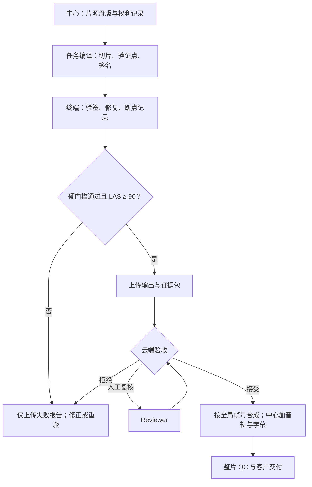

# DTVS Spec v0.2.2 — 非对称可验证媒体计算流程（冻结稿）

- **状态**：FROZEN / Pilot implementation baseline
- **冻结日期**：2026-08-27
- **适用 Pilot**：20 分钟旧电影、单台 RTX 4060、4K 修复与中文字幕交付
- **上一版本**：v0.2.1 Single-Node Pilot
- **许可证**：Apache-2.0（不覆盖片源、字幕、模型及第三方资产）

## 1. 目的与基本判断

DTVS 将中心的高价值判断能力与终端的闲置执行能力拆开：中心负责片源、切分、规则、验证点、调度与最终交付；终端只执行边界明确、参数冻结、结果可验证的计算任务。

DTVS **不主张**分布式节点天然比数据中心更快、更节能或更稳定。其待验证的经济命题是：在交付质量和事实验收标准相同的前提下，闲置节点的边际成本可以低于中心化资源的完全成本。

$$
C_{accepted}=C_{incentive}+C_{energy}+C_{transfer}+C_{storage}+C_{verification}+C_{recompute}+C_{orchestration}
$$

只有当合格结果的中位数成本 $\widetilde{C}_{accepted}$ 低于可比中心化方案，且质量、时限和恢复门槛同时满足时，才允许提出“更有性价比”的结论。

## 2. 规范用语与非目标

“必须”表示合规所需的强制要求；“应”表示除非有可记录理由，否则应遵守；“可以”表示可选实现。

本版本不证明：

- 已形成生产级分布式网络；
- 闲置算力一定具有成本或能耗优势；
- 单一画质分数等同于主观修复质量；
- 本地置信度等同于中心最终验收；
- 片源处于公共领域或拥有商业使用权。

## 3. 角色与责任边界

| 角色 | 必须承担的责任 | 不得替代的责任 |
| --- | --- | --- |
| 任务方 / 客户 | 提供合法素材、交付目标和授权边界 | 不直接决定节点是否合格 |
| 协调中心 Coordinator | 建立母版、切片、验证点、签名、调度、云端验收与合成 | 不以节点自报分数代替验收 |
| 终端 Worker | 验签、执行冻结流程、检查结果、提交证据 | 不改变模型、参数、帧范围或验收规则 |
| 云端验证器 Verifier | 完整性检查、隐藏抽检、复算或升级人工复核 | 不把本地 LAS 当成最终结论 |
| 人工复核员 Reviewer | 处理边界案例、主观伪影和争议任务 | 不修改原始证据与日志 |

## 4. 标准业务流程



终端本地检查是**上传带宽门控**；云端验证是**接受与结算门控**；整片 QC 是**客户交付门控**。三者必须分开记录。

## 5. 中心任务编译

### 5.1 母版冻结

中心必须保存以下不可变信息：

- 素材标识、来源、权利依据及使用限制；
- 原始文件 SHA-256、字节数、容器与编解码信息；
- 帧率、time base、分辨率、色彩空间、总帧数和音轨信息；
- 转码母版及其 SHA-256；
- 字幕来源、译者/模型、版本、时间轴和授权信息。

任何影响帧定位的母版变化必须生成新的 `asset_id`，不得覆盖旧任务。

### 5.2 场景切分与上下文

任务应按镜头或场景边界切分，而不是只按时间机械切分。生产建议：

- 核心输出区间：30–120 秒；
- 左右上下文：各 12–24 帧，可由模型需求调整；
- Worker 可以读取上下文，但只能返回核心区间；
- 每个核心帧只属于一个任务；
- 相邻任务以全局帧号连续，不得重叠或留缝。

Pilot v0.2.2 使用 20 个约 60 秒的核心任务模拟任务队列；场景边界导致的时长偏差必须记录。

### 5.3 验证点

中心必须为每个任务生成公开验证点与保密验证点：

- 公开验证点用于 Worker 本地自检，包括输入锚点、结构、边界和允许误差；
- 保密验证点仅供云端抽检，节点在提交前不可获得其具体位置或答案；
- 验证点必须基于输入事实、冻结参考流程或中心复算建立；
- 不得只使用 PSNR/SSIM 作为修复质量结论。

## 6. Task Bundle 合约

每个任务必须由中心签名，并至少包含：

| 字段组 | 必需内容 |
| --- | --- |
| 身份 | `spec_version`、`task_id`、`asset_id`、`bundle_version` |
| 帧范围 | `core_start_frame`、`core_end_frame`、上下文范围、全局 time base |
| 输入 | 下载地址或对象键、字节数、SHA-256、解码约束 |
| 执行 | Worker Pack 版本、模型标识与哈希、完整参数哈希、随机种子、目标设备要求 |
| 输出 | 分辨率、帧率、像素格式、色彩空间、允许编码器、核心帧数 |
| 调度 | lease、截止时间、checkpoint 周期、最大尝试次数 |
| 验证 | 硬门槛、本地评分规则、`upload_threshold=90`、公开验证点 |
| 安全 | 中心签名、签名算法、密钥标识、过期时间 |

Worker 必须拒绝未知版本、签名无效、哈希不符或已过期的 Bundle。参数变更必须生成新的 `bundle_version` 和尝试记录。

## 7. Worker Pack 与确定性执行

终端在领取任务前必须安装并通过 DTVS Worker Pack 预检。Worker Pack 至少包含：

- Bundle 验签和输入哈希校验；
- GPU、驱动、显存、磁盘、FFmpeg 与模型兼容检查；
- 冻结的修复执行器与命令清单；
- checkpoint、恢复、日志、能耗采样与输出哈希模块；
- 本地硬门槛与 LAS 评分器；
- 限制上传的状态机。

Worker 必须记录实际命令、软件版本、模型哈希、参数哈希、开始/结束时间、GPU 型号、驱动版本、功率采样、异常和重试。不得静默降级或替换模型。

## 8. 本地验证与 LAS

### 8.1 硬门槛

以下条件必须全部通过；任一失败时 LAS 不得解除上传限制：

1. Bundle 签名、输入哈希、模型哈希与参数哈希正确；
2. 输出分辨率、帧率、time base、像素格式符合约定；
3. 核心帧数精确，无缺帧、重帧、不可解码帧或异常黑帧；
4. 首尾边界和全局帧号映射一致；
5. 输出 SHA-256 和证据包完整；
6. 日志、checkpoint、执行环境和错误记录可追溯。

### 8.2 本地接受分数

LAS（Local Acceptance Score）是本次输出的本地置信度，不是节点信用，也不是中心最终验收。

| 分项 | 权重 | 示例检查 |
| --- | ---: | --- |
| 结构与锚点 | 25 | 关键帧结构、尺度和输入锚点一致 |
| 时序一致性 | 25 | 闪烁、跳变、运动连续性 |
| 伪影与幻觉 | 20 | 人脸、文字、边缘和纹理异常 |
| 亮度与色彩 | 15 | 亮度漂移、色偏、裁剪 |
| 边界连续性 | 15 | 相邻任务首尾接缝 |

$$LAS=0.25S_{anchor}+0.25S_{temporal}+0.20S_{artifact}+0.15S_{color}+0.15S_{boundary}$$

上传条件为：所有硬门槛通过、`LAS ≥ 90`，且任一软分项不得低于 70。评分器版本、原始测量值和阈值必须随证据包提交，不得只提交总分。

### 8.3 本地失败策略

未达到上传条件时，Worker 只能上传小型失败报告，包括任务/尝试标识、失败码、日志摘要、测量值、环境和证据哈希；不得上传失败视频。调度器随后选择本地重试、参数版本升级、人工检查或重派节点。

## 9. 上传、云端验证与状态机

### 9.1 上传内容

通过本地门控后，Worker 上传：

- 核心区间输出，不含上下文帧；
- 输出和各组成文件的 SHA-256；
- LAS 总分、分项、原始测量与评分器版本；
- 运行日志、checkpoint、环境清单和能耗采样；
- 帧号映射、编码信息和边界指纹；
- Worker 对 Evidence Manifest 的签名。

上传必须支持分块、断点续传、幂等提交和提交后哈希复核。

### 9.2 云端验证

中心必须对 100% 提交执行完整性、格式、哈希、帧数、全局帧号、黑帧和边界检查，并对 5%–10% 的保密帧执行质量抽检。Pilot 应至少对 10% 任务执行中心复算或独立对照。

云端可以根据风险提高抽检率：新节点、低 NRS、异常快任务、评分贴近 90、边界异常或重复失败任务应优先抽检。

### 9.3 任务状态

合法状态至少包括：

`CREATED → LEASED → RUNNING → LOCAL_REJECTED | UPLOADING → UPLOADED → CLOUD_CHECKING → ACCEPTED | REJECTED | HUMAN_REVIEW | REASSIGNED`

只有 `ACCEPTED` 允许进入合成和结算。状态变化必须包含时间、主体、原因码与前后证据哈希。

## 10. LAS 与 NRS 分离

NRS（Node Reputation Score）衡量节点的历史履约可信度；LAS 衡量单次结果。二者不得相互替代。

Pilot 的 NRS 建议权重为：

| 分项 | 权重 |
| --- | ---: |
| 历史云端验收通过率 | 40 |
| 按时完成率 | 25 |
| 证据完整性 | 20 |
| 故障恢复表现 | 15 |

NRS 只能基于云端已确认事件更新。节点自报性能、LAS 或未验收任务不得直接提高 NRS。调度器可以依据 NRS 调整 lease、任务价值、冗余率和抽检率。

## 11. 故障恢复、重派与防重复

- Worker 必须按 Bundle 周期写入 checkpoint，并记录最后完成的核心帧；
- lease 到期不等于结果失效，但过期提交必须进入云端冲突处理；
- `task_id + bundle_version + attempt_id` 必须唯一；
- 同一任务可有多个尝试，但只能有一个接受结果进入合成；
- 断点恢复不得重算已验证 checkpoint 之前的帧，除非完整性检查失败；
- 重派任务必须保留旧尝试及失败原因，禁止覆盖历史；
- 中心必须能在节点断网、关机、磁盘不足、低质输出和伪造证据后自动重派。

## 12. 中心合成与交付

中心仅合并 `ACCEPTED` 的核心视频区间，并按全局帧号排序。合并前必须证明：

- 从目标起始帧到结束帧连续覆盖；
- 无缺帧、重帧、重叠或错误版本；
- 相邻边界通过自动检查；
- 编码、色彩和 time base 可安全统一。

为避免字幕和音频被分片处理破坏，中心在视频合并后统一加入母版音轨和中文字幕，生成：

1. 带软字幕的交付母版；
2. 用于快速人工检查的烧录字幕审片版；
3. 最终 Evidence Manifest 和整片 SHA-256。

最终交付前必须执行整片解码、音画同步、字幕时间轴、首尾帧、黑场、接缝和人工抽检。

## 13. 安全、隐私与权利

- 任务必须使用最小权限、短期凭据和受限对象地址；
- Bundle 与 Evidence Manifest 必须签名，传输必须加密；
- Worker 不得保留、再分发或训练使用任务素材；
- 中心应设置本地缓存自动删除期限并保存删除记录；
- 机密项目可以采用加密分片、水印、可信执行环境或多节点拆分，但本版本不声称解决终端明文泄露；
- 公共领域判断必须逐国家/地区、具体版本、配乐、字幕和修复层分别核验。

## 14. 成本与能耗口径

每个被接受分钟必须同时披露边际口径和完整口径：

- 节点激励或机会成本；
- 终端增量用电；
- 下载、上传、云存储与出网；
- 本地及云端验证；
- 失败重算和冗余；
- 调度、软件维护与人工复核；
- 如适用，中心设施、冷却、折旧与管理成本。

报告必须优先使用“每合格 4K 分钟”的中位数、P25、P75 和 P95；不得只用最好节点、平均值或理论峰值。中心化对照必须使用相同输入、输出、模型、质量门槛和交付时间。

## 15. v0.2.2 单机 Pilot 操作剖面

单机 Pilot 在一台 RTX 4060 上模拟中心、Worker 和云端目录，但必须保持角色、密钥、状态和证据逻辑分离。

### 15.1 执行顺序

1. 选定合法的 20 分钟片段，冻结母版与字幕；
2. 中心按场景边界生成约 20 个 60 秒 Task Bundle；
3. 生成公开验证点和保密验证点，签名 Bundle；
4. Worker Pack 完成硬件、软件、磁盘、模型和签名预检；
5. 逐任务修复，写 checkpoint，计算硬门槛和 LAS；
6. LAS 不合格时仅产生失败报告；合格时复制输出与证据到模拟云端；
7. 中心对 20 个提交全部检查，并复算至少 2 个任务；
8. 仅合并 `ACCEPTED` 结果，统一加入音轨与中文字幕；
9. 执行整片 QC，生成成本、能耗、故障和质量报告；
10. 将配置、日志摘要、匿名化证据和结论提交到 GitHub。

### 15.2 强制故障注入

至少执行以下恢复测试，每种均记录恢复时间和重算帧数：

- 处理中断进程；
- 模拟断网或上传中断；
- 制造输出哈希不符；
- 制造低于 90 的 LAS；
- 制造一个边界或帧数错误。

### 15.3 Pilot 通过门槛

- 20 个任务均有明确最终状态；
- 接受结果合成后零缺帧、零重帧、零错误顺序；
- 本地门控与中心判断的一致率不低于 90%；
- 中心可自动合成视频并加入统一音轨与字幕；
- 中断后可恢复，且不重新处理已接受任务；
- 输入、参数、运行、结果、验证和状态变化全链路可追溯；
- 报告披露全部失败、重算、传输、验证和人工成本。

达到上述门槛只说明流程可运行，不等同于经济性或规模化已经成立。

## 16. 证据包最低目录

```text
evidence/<run_id>/
├── run_manifest.json
├── coordinator/
│   ├── asset_manifest.json
│   ├── task_index.json
│   └── hidden_check_summary.json
├── tasks/<task_id>/
│   ├── task_bundle.json
│   ├── task_bundle.sig
│   ├── attempt_manifest.json
│   ├── checkpoints.jsonl
│   ├── local_qc.json
│   ├── output.sha256
│   └── cloud_verdict.json
├── merge/
│   ├── accepted_index.json
│   ├── boundary_qc.json
│   └── final.sha256
└── reports/
    ├── quality.json
    ├── energy.csv
    ├── cost.json
    └── failures.json
```

媒体文件不得默认提交到公开仓库；公开证据应使用哈希、匿名化摘要和可复现实验配置。

## 17. 最低失败码

| 失败码 | 含义 | 默认动作 |
| --- | --- | --- |
| `BUNDLE_SIGNATURE_INVALID` | Bundle 签名无效 | 拒绝执行 |
| `INPUT_HASH_MISMATCH` | 输入不一致 | 重新下载或停止 |
| `ENVIRONMENT_UNSUPPORTED` | 环境不满足要求 | 不领取任务 |
| `OUTPUT_STRUCTURE_INVALID` | 帧数、格式或时间轴错误 | 本地拒绝 |
| `LOCAL_SCORE_BELOW_THRESHOLD` | LAS 或分项未达标 | 本地拒绝/重试 |
| `EVIDENCE_INCOMPLETE` | 证据缺失或不可验证 | 拒绝上传/云端拒绝 |
| `CLOUD_HIDDEN_CHECK_FAILED` | 保密验证点失败 | 拒绝或人工复核 |
| `LEASE_EXPIRED` | 提交超过 lease | 冲突检查或重派 |
| `DUPLICATE_ACCEPTED_RESULT` | 已存在接受结果 | 隔离重复提交 |

## 18. 版本治理与冻结规则

v0.2.2 冻结的是 Pilot 的角色边界、状态机、LAS/NRS 分离、上传门控、证据要求和验收口径。实现中的缺陷通过 Issue 记录。

- 拼写、链接和不改变语义的说明可作为 v0.2.2 勘误；
- 阈值、权重、状态、必需字段或责任边界的变化必须进入新版本；
- 所有 Pilot 数据必须注明所执行的精确 Spec、Worker Pack 和评分器版本；
- 未通过冻结门槛的结果必须标记为 `FAILED` 或 `PARTIAL`，不得选择性隐藏。

本标准的原创时间线以公开 Git commit、Release、Issue 和可验证 Pilot 证据为准；“最先发布”不替代可复现性和持续治理。
